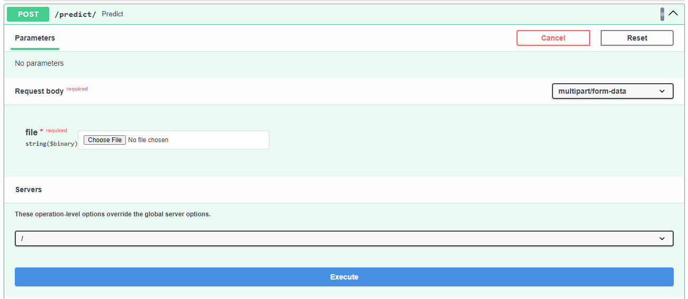

# Proyecto: Detección de Neumonía a partir de Rayos X utilizando Redes Neuronales Convolucionales (CNN)

## Descripción del Proyecto

Este proyecto tiene como objetivo desarrollar un modelo de *Deep Learning* para detectar neumonía en imágenes de rayos X. Utilicé redes neuronales convolucionales (CNN), que son particularmente efectivas para tareas de clasificación de imágenes, para entrenar un modelo capaz de identificar si un paciente tiene o no neumonía a partir de radiografías.

La solución está diseñada para ayudar en la detección temprana de neumonía, proporcionando un soporte de diagnóstico más rápido y preciso a los médicos.

## Despliegue del Modelo - API
El modelo entrenado fue guardado como un archivo `.h5` para facilitar su posterior reutilización y despliegue. El despliegue del modelo está disponible en [este enlace](https://udd-proyecto-ds-ia-m7-api.onrender.com/docs) hecho en [Render.com](https://render.com/). 

### Atención: 
#### Dado que la cuenta utilizada en Render es gratuita, el servidor puede entrar en modo de suspensión cuando no está en uso, lo que puede ocasionar algunos minutos de demora en la carga y respuesta inicial de la API.

Cuando se haga la carga inical, la API puede probarse en la sección de POST como se ve en esta imagen:

## Presentación
La presentación del proyecto donde establezco temas como el problema, el proceso de solución, gráficas de rendimiento y demostración del modelo la puedes encontrar en el [siguiente enlace](https://drive.google.com/file/d/1HkzzhqFKP5pWlWxZ3JN2d3-sYNoqOzHr/view?usp=sharing).

## Conclusiones y Aprendizajes
Durante el desarrollo de este proyecto, aprendí la importancia de ajustar correctamente los hiperparámetros para mejorar el rendimiento del modelo. También reforcé mis habilidades en la creación y despliegue de modelos de Deep Learning, así como en el uso de técnicas de visualización para interpretar el rendimiento del modelo.

El modelo es capaz de identificar de manera confiable los casos de neumonía, aunque aún hay margen para mejorar la precisión de la detección de pacientes sin neumonía, lo que puede ser crucial en aplicaciones médicas reales.

## Futuras Mejoras
Algunas mejoras que podrían implementarse en el futuro incluyen:

- Aumentar la complejidad del modelo para mejorar la capacidad de generalización.
- Utilizar técnicas de ensamblado para combinar diferentes modelos CNN.
- Experimentar con otros optimizadores o técnicas de regularización para reducir el sobreajuste.

## Contacto
Si tienes alguna pregunta o comentario sobre este proyecto, no dudes en contactarme a través de mi [perfil de GitHub](https://github.com/Franco-Odone).